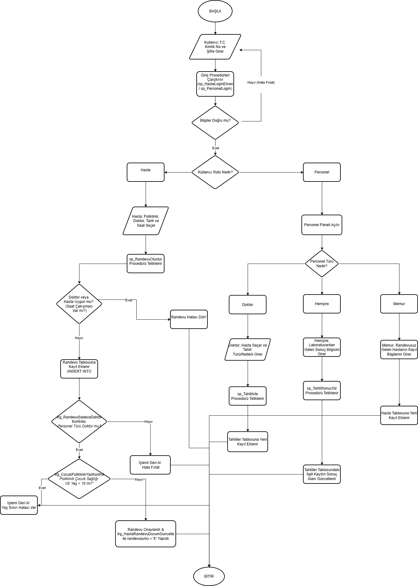

# VeriTabaniHastaneUygulamasi
 
Kocaeli Üniversitesi Bilişim Sistemleri Mühendisliği Bölümü - TBL331 Veritabanı Yönetim Sistemleri Dersi Dönem Projesi kapsamında geliştirilmiş **Hastane Otomasyon Sistemi** uygulamasıdır.
 
---
 
## 1. Problem Tanımı
Bu proje, modern bir sağlık merkezinin ihtiyaç duyzada hasta kayıt, poliklinik randevu takibi, doktor/personel yönetimi, tahlil istek/sonuç girişi ve reçete işlemlerini dijitalleştirmek amacıyla tasarlanmıştır. Sistem, veri bütünlüğünü ve tutarlılığını gelişmiş veritabanı kuralları ile korurken; hastaların doğru poliklinikten hızlı randevu alabilmesini, doktor ve hemşirelerin koordineli çalışabilmesini sağlar.
 
---
 
## 2. Yapılan Araştırmalar ve Karşılaşılan Sorunlar
* **Çözümler ve Araştırmalar:** Node.js backend ile SQL Server entegrasyonu asenkron yapılarla kurgulanmıştır. İş mantığı kurallarının (Örn: Yaş sınırı kontrolü, mükerrer randevu engelleme) uygulama katmanı yerine doğrudan veritabanı katmanında (Triggers & Procedures) çözülmesi üzerine araştırmalar yapılmıştır.
* **Sorun Giderme (Entegrasyon Süreci):** Node.js arayüz entegrasyonu sırasında, dinamik olarak seçilen hastaların tahlil sonuçlarının listelenmesinde sorunlar yaşanmıştır. Yapılan incelemede `vw_RandevuGosterim` ve `vw_TahlilListesi` görünümlerinde (Views) `hastaID` kolonunun eksik olduğu fark edilmiş; görünümler `ALTER VIEW` komutları ile güncellenerek backend veri akışı başarıyla sağlanmıştır.
 
---
 
## 3. Yazılım Mimarisi ve Akış Şeması
 
### Yazılım Mimarisi
Proje, katmanlı ve modüler bir mimari yapı üzerine inşa edilmiştir:
* **Frontend (Arayüz):** Kullanıcı dostu, dinamik tasarım için HTML5, CSS3 ve **Bootstrap** kullanılmıştır. Dosyalar `frontend/Hastane_Otomasyonu` dizininde yer almaktadır.
* **Backend (Sunucu Mantığı):** Sunucu tarafında asenkron veri yönetimini sağlamak amacıyla **Node.js** tercih edilmiş olup, veritabanı bağlantı kodları ana proje dizininde (`server.js`) organize edilmiştir.
* **Veri Tabanı Katmanı:** Tüm ilişkisel veriler, kısıtlayıcılar ve gelişmiş nesneler **SQL Server** üzerinde yürütülmektedir.
 
### İşlem Akış Şeması
1. **Giriş Paneli:** Kullanıcı T.C. Kimlik No ve Şifre ile sisteme başvurur (`sp_HastaLoginEkran` veya `sp_PersonelLogin`).
2. **Rol Doğrulama:** Sisteme giriş yapan kullanıcının rolüne göre (Hasta, Doktor, Hemşire, Memur) ilgili arayüz paneli yüklenir.
3. **Randevu İşlemi:** Hasta randevu talep ettiğinde doktor müsaitliği ve hastanın yaşı veritabanında kontrol edilir, süreç başarılıysa kayıt tetiklenir.
 
> **Mimarisi ve Akış Şeması Görseli:**
> 
 
---
 
## 4. Veri Tabanı Tasarımı (ER Diyagramı ve Kurallar)
 
Veritabanı tasarımı **5N (Normalizasyon)** kurallarına tam uyumlu olarak **7 ana tablodan** oluşmaktadır. Sistemde veri bütünlüğünü sağlayan `Primary Key (PK)`, `Foreign Key (FK)`, `UNIQUE` ve `CHECK` kısıtlayıcıları eksiksiz kurgulanmıştır.
 
### Veri Tabanı İlişkisel ER Diyagramı

 
### Tablo Yapıları
1. **Hasta:** Hastaların kişisel bilgilerini, T.C. kimlik numaralarını (`CHECK` kısıtlamalı 11 haneli), adres bilgilerini ve sistem şifrelerini tutar.
2. **Poliklinik:** Hastanede aktif hizmet veren 10 adet ana poliklinik bilgisini barındırır.
3. **PersonelTuru:** Sistemdeki idari ve tıbbi rollerin tanımlandığı tablodur (*Doktor, Hemşire, Memur*).
4. **Personel:** Doktorlar, hemşireler ve memurlara ait uzmanlık alanı, T.C. kimlik numarası ve bağlı oldukları poliklinik bilgilerini yönetir.
5. **Randevu:** Alınan randevuların tarih, saat bilgilerini tutar.
6. **Recete:** Doktorlar tarafından hastalara yazılan ilaç bilgilerini ve ilişkili personeli bağlar.
7. **Tahliller:** Doktorların istediği tahlil türünü, nedenini ve hemşireler tarafından girilen sonuçları tutar.
 
>**Test Verisi (Dummy Data):** Sistemdeki View, Trigger ve Procedure yapılarının test edilebilmesi amacıyla her bir tabloya gerçeği yansıtan anlamlı veriler girilmiştir. Sistemde toplamda:
* **Poliklinikler:** 10 adet ana branş (Kulak Burun Boğaz, Dahiliye, Kardiyoloji, Çocuk Sağlığı vb.) eklenmiştir.
* **Personeller:** Farklı polikliniklere ve uzmanlık alanlarına dağıtılmış 30 adet Doktor, 10 adet Hemşire ve poliklinik bağımsız çalışan 5 adet Memur olmak üzere toplam **45 anlamlı personel verisi** girilmiştir.
* **Test Hastaları:** Sistem süreçlerini, giriş ekranlarını ve kısıtlamaları denemek amacıyla T.C. Kimlik ve şifre kısıtlamalarına uygun (Örn: *Nisanur Çap*, *Melike Bulut* gibi) aktif hasta kayıtları tanımlanmıştır.
* **İşlem Verileri:** Sistemdeki tetikleyicileri ve stored procedure yapılarını test etmek üzere bu hastalar üzerinden oluşturulmuş örnek **Randevu** ve laboratuvar süreçleri için **Tahlil** (Kan tahlili vb.) kayıtları hazır olarak bulunmaktadır.
 
---
 
## 5. Gelişmiş Veri Tabanı Yapıları (Programlanabilirlik)
 
### 1. Tetikleyiciler (Triggers)
* **`trg_CocukPoliklinikYasKontrol`:** Çocuk Sağlığı polikliniğinden (ID: 4) randevu alınmak istendiğinde, hastanın doğum tarihini kontrol ederek 18 yaşından büyük kişilerin randevu almasını engeller (`ROLLBACK TRANSACTION`).
* **`trg_RandevuSadeceDoktor`:** Randevu tablosuna ekleme veya güncelleme yapılacağı zaman, ilgili `personelID`'nin türünü kontrol eder. Personel türü 'Doktor' (ID: 1) değilse işlemi iptal eder.
* **`trg_HastaRandevuDurumGuncelle`:** Yeni bir randevu kaydı oluşturulduğunda, Hasta tablosundaki ilgili hastanın `randevulumu` alanını otomatik olarak 'E' (Evet) şeklinde günceller.
 
### 2. Saklı Yordamlar (Stored Procedures)
* **`sp_HastaLoginEkran` / `sp_PersonelLogin`:** Giriş yapmaya çalışan hasta veya personelin T.C. ve şifre kontrolünü güvenli bir şekilde yapar. Başarısız girişlerde hata fırlatır.
* **`sp_RandevuOlustur`:** Randevu oluşturulmadan önce iki aşamalı kontrol yapar: 
  1. Seçilen doktora aynı gün ve saatte başka randevu verilmiş mi? 
  2. Seçilen hasta aynı gün ve saatte başka bir poliklinikten randevu almış mı? Kontrollerden geçerse randevuyu başarıyla ekler.
* **`sp_TahlilIste`:** Doktorların sadece tahlil türü ve isteme nedenini girerek sonuç kısmını `NULL` bırakacak şekilde tahlil talep etmesini sağlar.
* **`sp_TahlilSonucGir`:** Hemşirelerin, ilgili tahlil kaydını bularak laboratuvardan gelen sonucu sisteme girmesini sağlar.
 
### 3. Görünümler (Views)
* **`vw_RandevuGosterim`:** Randevu, Hasta, Personel ve Poliklinik tablolarını `INNER JOIN` ile birleştirerek tüm aktif randevuları detaylı ve okunaklı tek bir liste halinde sunar.
* **`vw_TahlilListesi`:** Tahlil sonuçlarını, tahlili isteyen doktoru ve ilgili hastanın T.C. bilgilerini bir arada gösteren raporlama görünümüdür.
 
### 4. İndeksler (Indexes)
Arama performanslarını optimize etmek amacıyla kritik alanlarda tekil indekslemeler yapılmıştır:
* `IX_Hasta_TC` & `IX_Hasta_Sifre` (Hasta Tablosu)
* `IX_Personel_Sicil` & `IX_Personel_Sifre` (Personel Tablosu)
 
---
 
## 6. Genel Yapı (Proje Özeti)
Bu proje; hastaların, doktorların, hemşirelerin ve idari memurların kendilerine ait yetki alanları dahilinde işlem yapabildiği bütüncül bir otomasyon sistemidir. Veritabanı mimarisi, uçtan uca veri kayıplarını ve tutarsızlıkları engelleyecek katı kurallarla (`Constraints` ve `Triggers`) donatılmıştır. Kullanıcı dostu Bootstrap arayüzü sayesinde tüm sağlık personeli laboratuvar süreçlerini ve randevuları anlık olarak takip edebilmektedir.
 
---
 
## 7. Geliştirme Ortamı ve Teknoloji Yığını
* **IDE:** Visual Studio
* **Veritabanı Yönetim Sistemi:** SQL Server / SQL Server Management Studio (SSMS)
* **Diller:** T-SQL, JavaScript (Node.js), HTML5, CSS3
* **Framework / Kütüphaneler:** Bootstrap, Express.js, mssql
 
---
 
## 8. Projenin Kurulumu ve Çalıştırılması
1. **Depoyu Klonlayın:**
```bash
git clone [https://github.com/nisanrcap/HastaneManagementUygulama.git](https://github.com/nisanrcap/HastaneManagementUygulama.git)